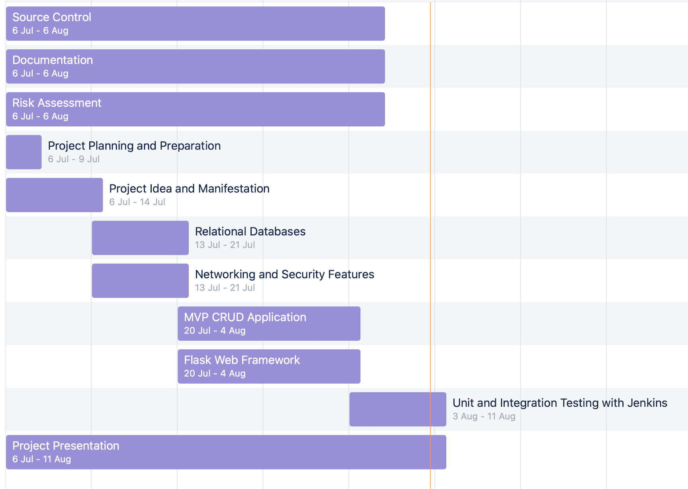
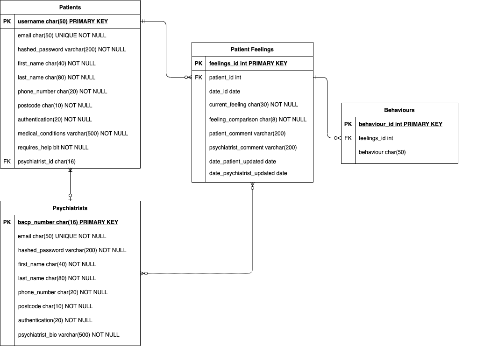
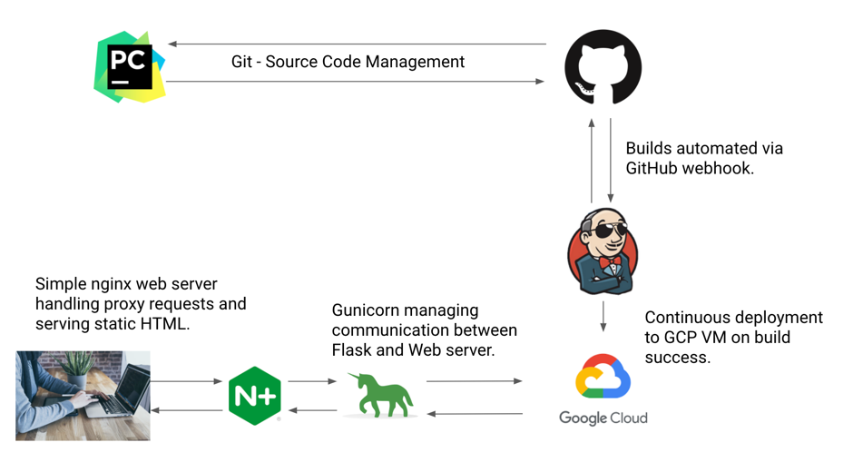

[//]: # (Implicit Links Within Project)

[1]: https://docs.google.com/spreadsheets/d/1C1NilfOavO-xX1UOnmB7djAXTZ_X5EZ-cNiQfMzb8rI/edit?usp=sharing   "Risk Assessment"
[2]: https://docs.google.com/presentation/d/1BL5r35I7me4MSkJispzxlc57zhBZT7YtfSIj4wbV7tA/edit?usp=sharing   "Presentation"
[3]: https://team-1579095236068.atlassian.net/jira/your-work   "JIRA Project"
[4]: https://www.bma.org.uk/advice-and-support/nhs-delivery-and-workforce/workforce/mental-health-workforce-report   "mental health workforce report"

# MiWell

😀 🙂 😶 😕 😔 😢 😡

**A _smarter_ tool for tracking patient mental health.**

_Created for QA Consulting by Joshua Higginson_

## Contents

- [Project Brief](#project-brief)
  - [Resources](#resources)
  - [Requirements](#requirements)
- [Project Approach](#project-approach)
- [Project Architecture](#project-architecture)
  - [Database Structure](#database-structure)
  - [CI Pipeline](#ci-pipeline)
  - [Front End Development](#front-end-development)
- [Testing](#testing)
 - [Unit Testing](#unit-testing)
 - [Functional Testing](#functional-testing)
- [Project Management](#project-management)
- [Project Review](#project-review)
  - [Known Issues and Future Optimisation](#known-issues-and-future-optimisations)
- [Authors](#authors)

## Project Brief

Workforce shortages in mental health are affecting the ability for staff to provide good quality of care.

The client is a mental health charity, who want a simple and streamlined way to monitor the progress of individuals at risk of relapse.

Unfortunately, the patient to psychiatrist number is exceedingly high, and the client needs an easy way for the referees to keep track of mood, and automatically select the best course of treatment for individuals.

A previously commissioned app was incredibly bulky, and as a result, patients often fall off and lose interest in updating their mood.

> Individuals log into the app, and every day, mark their mood from a selection of values.

> This COULD be done through pressing a button on screen to mark their mood, using emojis, with text underneath for autistic individuals.

> They must also be able to provide a short ‘twitter message’ style update.

> They could be also be able to select how many minutes of mindfulness practice they have achieved on a sliding scale.

> A client is then given a semi-personalised task for helping to improve or maintain their mood.

---

> A referee can log into the app, and see the progress of their patients.

> The referee should be able to leave a short, personalised reply.

> If a patient is ‘at risk’, the referee is notified immediately, and provided with the offending comment, as well as personal contact details.

---

> Referees should be able to log on and add new mindfulness tasks to an existing database.

> Both Patients and referees should be able to edit the response, if something bad happens in the day and needs immediate attention.

---

> There could be push or email notifications sent to the patient if they have forgotten to provide feedback that day.

> Perhaps a patient can track their mood over time with a graphical interface.

> The app could provide different motivating messages each day, so that the user won’t get bored.

### Resources

- View my full risk assessment document [here.][1]
- View my project presentation [here.][2]
- View my JIRA Project [here.][3]

## Project Approach

 I tackled this project from a 'top down' perspective. First envisioning a working application, and designing an application 'skeleton' around this. 
 The main two tools I used to achieve this within Flask were Jinja2 templating, and blueprints. This approach was inspired by Todd Birchard of Hackers&Slackers.
 
My project in it's current state (10th August 2020) satisfies _some_ QA assessment criteria. Areas marked with a ~~strikethrough~~ indicate tasks in which I must still complete.

- Create both psychiatrist and patient account accounts, which hold a relationship. (C).
- Patients are automatically assigned to psychiatrists on registration.
- If there are no psychiatrists in the system, a patient cannot register.
- There cannot be two accounts with the same email in the **database** (not just one table.)

- Our users can read data on, update, and delete their accounts. (RUD).

- Create a patient 'mood tracking' page, which allows users to enter an update a unique mood every day. (C)
- ~~Our patient can view, track, update, and delete their previous moods.~~

- The web app automatically flags a patient as 'requires assistance' if a low mood has been entered today.
- Our psychiatrists can view the information of patients who require assistance.
- ~~On a separate page, psychiatrists can see a list of posts that they haven't currently reviewed.~~
- ~~Psychiatrists can comment on user moods.~~ (Framework is in place, however functionality was a lot more difficult than first envisioned.)

Although **full** CRUD functionality has not yet been implemented, I have been working very hard on this project, having additionally implemented:

- User authentication.
- Custom favicons, which change depending on which user is currently logged in.
- Custom error handling.
- Meticulous attention to detail in bug fixes.
- A custom test server class for Flask apps running on an application factory model.
- The start of a Page Oriented Model approach to functional testing.
- Nginx acting as reverse-proxy so that our app can be accessed by a domain name: www.miwellness.co.uk
- An automated risk assessment spreadsheet that adheres to industry standard automated tolerance levels. _With. Dynamic. Colours._ 

## Project Management

Spoilers: I've never built an application before. 

###### _"...They'll probably mention that again in this readme."_

When I first found out the project specification from QA, I knew that I would have to structure the creation of my app around the learning of said new technologies.
My JIRA project roadmap was created in a manner which replicates and corresponds with my first 6 weeks of study at QA.

In my JIRA settings, I configured additional support for bug tracking, issue tracking, and user stories. In a production environment, new features are normally implemented through user stories.
I made some attempts to work with user stories, but I found this way of thinking rather alien to me without a functioning app, and without actual clients to test.

Every time I've shown my web app to F&F, the first thing they mention is that it looks like a relic of 1990. 

In _reality_, the very first thing I would do is strap a bootstrap template on my project - Working to fix a true user story case.
However in the context of this QA assessment with set project parameters and a strict mark scheme, I mostly chose to structure my backlog around _issues_.

As a developer who favours theory and ideas, before I can truly justify implementing a new feature into my project, I have to truly understand it first.
Not really knowing that much at all about app development however, meant that my story point estimates have been _rather diabolical_.

To aid myself in this process, one incredibly useful implementation to my project management workflow was the introduction of MoSCoW analysis. 
Although perhaps not a great indicator of **time spent,** from a more abstract view of planning poker T-shirt sizes in order to gauge the complexity of a project.

I wanted to keep both _security_ and _file structure_ in high focus. Particularly as I knew that I would be deploying my app to a live production environment.

I made sure that all of my admin passwords were strong, and stored in a password manager. I used linux environment variables, and eventually a .env file to store secret information required for my app to function.

After just a few days of coding the registration functionality, my app was already turning into spaghetti code. If I hadn't organised my code into snippets and blueprints, it would have became a monolithic beast.

## Project Architecture

One of the things I have enjoyed most about my time at QA so far has been learning about databases and database structure. I am already confident in the use of DDL to model database schema.
When I was first introduced to SQL, I couldn't quite grasp the concept of ORM. Now, I'm living my best life, creating complicated SQLAlchemy queries, and enjoy the process of database modelling, updates, and queries.

### Database Structure

There are three main facets to my database structure: Patients, Psychiatrists, and Feelings. I like to think of 'behaviours' as branching from the feelings table in order to provide extra functionality down the line.
At the very start of my project, this ERD was a lot more sporadic, as I first failed to realise the concepts and importance of joins.

#### Dynamically assigning patients with a new psychiatrist. 

After learning about SQLAlchemy's db.relationship() module and tearing up my original database design, my next task was to _dynamically assign_ a psychiatrist to any new patients upon registration.

I thought that the best way of doing this would be to perform an outer join on the psychiatrist and patient tables.
In theory, I could then use the aggregate function COUNT() in order to calculate each psychiatrist's workload.

**Note: In _theory_. The following code did not make it's way into the final project.**

We assign the patient with the psychiatrist with the _least number of other patients_ assigned to them.

` SELECT psy.bacp_number, COUNT(pat.username) `  
` FROM psychiatrist psy `  
` LEFT OUTER JOIN patient pat `  
` ON psy.bacp_number=pat.psychiatrist_id `  
` GROUP_BY psy.bacp_number; `

**Unfortunately for us,** when we convert this code into SQLAlchemy syntax, we omit all 'null entries' within our join table.

`psych_on_patients_join = db.session.query(Psychiatrist.bacp_number, func.count(Patient.username)).outerjoin(Psychiatrist, Psychiatrist.bacp_number == Patient.psychiatrist_id).group_by(Psychiatrist.bacp_number).first()`

`(chosen_psychiatrist, patient_count) = psych_on_patients_join`

This code would not include any of the psychiatrists with no previously assigned patients, aka, a ‘_null_ result’.

##### The Fix

My chosen fix for this issue was to ‘unpack’ a larger subset of our SQLAlchemy table into a _Python dictionary_.

Once I had the data within python itself, it became far easier for me to manipulate the code with functions with Pythonic syntax.

### CI Pipeline

This image shows the integrated technologies of which I utilised in the creation of my flask web app.
 
I chose to code primarily in PyCharm on my local machine rather than in VIM on a CLI for all of the obvious reasons:
- Coding efficiency.
- Project management and organisation.
- Plugins.
- The use of an integrated linter.
- Database diagnostic tools.

My PyCharm editor is integrated with a git SCM where I can make commits and push code straight from my IDE.

GitHub is my preferred VCS Provider.

I configured Jenkins as as a CI server, which automatically builds my flask application via an integrated GitHub webhook. 
On a build success, Jenkins pushes my code to a GCP virtual machine and automatically runs my flask application as a systemd service.
I am using Gunicorn as a WSGI. As a stretch goal, I also built the simplest of web servers with Nginx.

### Front End Development

There really isn't much to talk about right now in terms of front-end development. I used a few HTML tags, notably on the user greeting page, to ensure that my data was clearly laid out.

I also utilised Jinja2 logic in a number of places, most notably to '' code from snippet files of HTML. 

I used  loops to display repeated sets of information on my psychiatrist dashboard, and  statements when configuring my Flask message flashing functionality.

## Testing

Alas, now is the time I put my hands up and admit, on 10th August 2020, I currently have **0% CODE COVERAGE.**
...And I realise that this was a large percentage of the SFIA project specification. 

I want to do my tests justice, and I still don't massively understand some of the core functionality behind unit testing in particular.

### Unit Testing

My entire 'project time' budget was spent trying to get Selenium and integration tests functional.
After we moved onto Linux and Systemd services, it was devastatingly clear that I had run out of time.
It all comes back to story point estimation. 
 
My plan was to revisit testing after my project was integrated to Jenkins, so that I would be able to automate my builds after they passed unit tests.
It took me 100 manual Jenkins builds for my application to run as a systemd service with Jenkins as a CI server, and my application actually running without errors.

### Functional Testing

That being said, although I have no unit tests to my name, I have the beginnings of a functional testing suite.

#### My approach to functional testing.
After an afternoon of research into functional testing, I decided that I wanted to write some tests which used a **Page-Object Model** approach.

>> The Page-Object model is one of many approaches to structuring test code.
>> Each page of our web application is associated with it's own **'page class'.**
>> 'Page classes' contain a reference to every _functional_ element of code as a **'elements'.**
>> Our tests can then utilise the methods of this page object class whenever they need to simulate interaction with the UI.

I chose this approach for a few specific reasons:

1. My application code is already organised into blueprints. It makes sense that my test elements are organised in a similar way.

2. If I were to add a UI to my app later down the line, I wouldn't have to rewrite every test. Only change the way in which the 'page class' references the UI.

3. I hate having to repeat code.

### UI Testing with Selenium.

Selenium is a web browser automation tool that supports the most popular web browsers, across Windows, MacOS and Linux. It requires a 'web driver' to run tests within a web browser.

When I first heard about Selenium, I got incredibly excited. I started thinking of all the ways it would speed up my development.
Testing my apps by hand, I like to employ a 'fuzz' testing mindset - trying to do things outside of the normal realm  thought that if I could implement it into my own project.

### Issues with Flask-Testing.

_This section of the documentation will cover my experience with the Flask-Testing module, why I chose to scrap the LiveServerTestCase class shown on QA courseware, and how I spent **way** too long designing my own multi-threaded test framework._

Test_client() is a _lightweight browser emulation_ that comes prebuilt into flask. This makes it easier for developers to test their programs without having to write their own.
However, this client cannot fully emulate the environment of an application running within a browser.

There are a number of things that it will **not** do. The test_client() browser cannot execute JavaScript code, which makes it impossible to fully test an interactive UI. 
Any code that is included within a http response will be returned without having been executed.

For this project, I wanted to ensure that my functional tests were running in a ‘true-to-life' production environment.

This is why I chose to run my functional tests on a use a real web browser, hat is connected to our application, running on a real web server. 

## Project Review

Here is the section where I review the progress of my project so far (10th August 2020).

I mentioned earlier that I see this project as an ‘evolution’.
This isn’t something that I want to abandon, in fact, I think that it’s app that NEEDS to exist,
with further collaboration from mental health professionals, a team of developers, and some charity funding behind it.

With a little bit of extra time in development, this app could truly make a difference to someone’s life.

Sometimes, I wish that I had chosen an easier brief. But in a true working environment, you can’t just pick and choose your battles.
 
Where I might not have the full CRUD functionality, or have a pretty JIRA board, or amazing test coverage that you might have expected from this Flask app.
And I have already learned tremendous amounts from trying, and failing, at this project!

I knew that my project was going to be large when approaching this task.
Therefore, I chose to organise my project into blueprints, for logic, code readability and ease of navigation.
This meant that I had to design my project with an application factory, in order to avoid circular imports.
Here, I learned about application context and request context in relation to python applications.

Selenium NOT want to play nice with me because of this, and therefore I spent a day of production, designing a custom Test Server script for use with Selenium-wire and python unittest.
 
Not only did I learn more about test driven development, but I had to try and understand threading, so that I could run my tests in parallel alongside selenium.

### Known Issues and Future Optimisations

When you delete a user, or psychiatrist from the database, it breaks our relationship model. Also, users' posts become orphans in our database.
I already have knowledge and code available in my project to fix this issue. However, it will take an unknown amount of time to implement.

You can enter any old string of text into the phone number section. Our input validation is a little bit lacking. I would love to take time in the future to fix this.

I need to finish full implementation of CRUD functionality.

CSS styling is a big one. Maybe even learn about JS/Angular/Vue and have a really fancy website that actively makes people want to log on every day.

There are many, many more tiny little changes that I would love to make.

## Authors

**Josh Higginson** - _Junior DevOps Consultant for QA Consulting._

